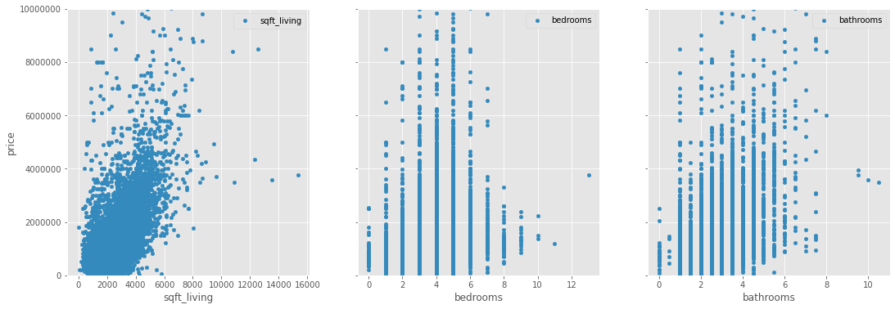

# King County Real Estate 
Project for phase 2 of Flatiron's data science program

**Author:** [Emmi Galfo](mailto:emmi.galfo@gmail.com)

## Overview 

This project looks at factors that influence price in the King County real estate market. Through linear regression modeling, predictors such as square footage, number of bedrooms, number of bathrooms, condition, grade, and views were factored in to determine their effects on housing price. The project ultimately finds that more bedrooms are associated with lower prices, and conversley, more bathrooms and square footage are each assiciated with higher home prices all else constant.  The better views are linked with higher home prices as well as better grade and home conditions all else constant. 

## Business Problem

A real estate agent is helping a couple find a house in King County. In order to stay within a set budget, the couple is interested in seeing how different factors affect overall price. This project looks at the following variables and their affect on the price of buying a house in King County, Washington:
*  Square Footage
*  Number of Bedrooms
*  Number of Bathrooms
*  House Condition 
*  Quality of the View

## Data Understanding

For this project, data was gathered and used from the King County assessor's website. Below are descriptions taken from the database describing each column used in this project.  

### Column Names and Descriptions for King County Data Set

* `id` - Unique identifier for a house
* `price` - Sale price (prediction target)
* `bedrooms` - Number of bedrooms
* `bathrooms` - Number of bathrooms
* `sqft_living` - Square footage of living space in the home
* `view` - Quality of view from house
  * Includes views of Mt. Rainier, Olympics, Cascades, Territorial, Seattle Skyline, Puget Sound, Lake Washington, Lake Sammamish, small lake / river / creek, and other
* `condition` - How good the overall condition of the house is. Related to maintenance of house.
  * See the [King County Assessor Website](https://info.kingcounty.gov/assessor/esales/Glossary.aspx?type=r) for further explanation of each condition code
* `grade` - Overall grade of the house. Related to the construction and design of the house.
  * See the [King County Assessor Website](https://info.kingcounty.gov/assessor/esales/Glossary.aspx?type=r) for further explanation of each building grade code

Most fields were pulled from the [King County Assessor Data Download](https://info.kingcounty.gov/assessor/DataDownload/default.aspx).

## Data Preparation

### Target: 
The target variable for this project is __price__. The clients want to know how much certain factors will contribute to the overall price of a house. 
Let's look at the correlation each factor has with price. 

Using the correlations above I see two things:
* The heatmap shows that square footage of living space and above grade square footage are strongly correlated with each other. This makes sense; it follows that the more above grade square footage, the more square footage of living space. In order to avoid multicollinearity, only one of these factors should be used. Square footage of living space has a higher correlation than above grade square footage. So when looking at square footage, I will use this one as one of the predictors.  
* Of the factors that the clients are intersted in looking at, square footage of living space has the highest correlation with price. This is a good place to start for the baseline model. 

### Predictors: 
The predictors that the clients are most intersted in are __square footage of living area, number of bathrooms, number of bedrooms, condition of the home, grade of the home, and quality of views__. 

## Baseline Model: Square Footage

I will use square footage of living space as my factor for my baseline model because it is relevent to the business problem and has the highest correlation with the target variable, price. 

##### Interpretation
The model is significant overall. The model explains 37% of the variance in price. 
The constant and coefficient are both significant. 

The constant is a bit non-sensical at this point stating that a home with no square footage would cost -74k USD. 

The model shows that for every square foot in living area, the price goes up by about 560 USD. 
This may seem expensive but it is consistent with a mean square footage of 2,112 and a mean price of 1.1 million USD.

Overall, I don't think this is a very good model because it only explains 37% of the variance.

## Second Model: Square Footage, Bedrooms, Bathrooms

### Adding additional numerical factors: 
Three of the six factors we are considering are numeric: square footage, bedrooms, and bathrooms. 

Just by looking at the graphs, it seems that square footage of living space, bedrooms, and bathrooms have positive correlations. Though bedrooms looks a little weaker. This is consistent with what the heatmap showed previously. Let's look at the linear regression model. 

##### Interpretation
The model is significant overall. The model explains ~39% of the variance in price. The constant and coefficients are all significant. 

The constant shows a starting value of 201k USD. For King County, this seems reasonable. 

The model shows that for every additional sqare foot in living area, the price goes up by about 616 USD all else constant. 

Adding bedrooms brings down the price of the house by about -162K per bedroom, all else constant. 

For each bathroom the house price goes up by about 68k per bathroom, all else constant. 

Overall, the model seems weak with only explaining 39% of variance in price.

