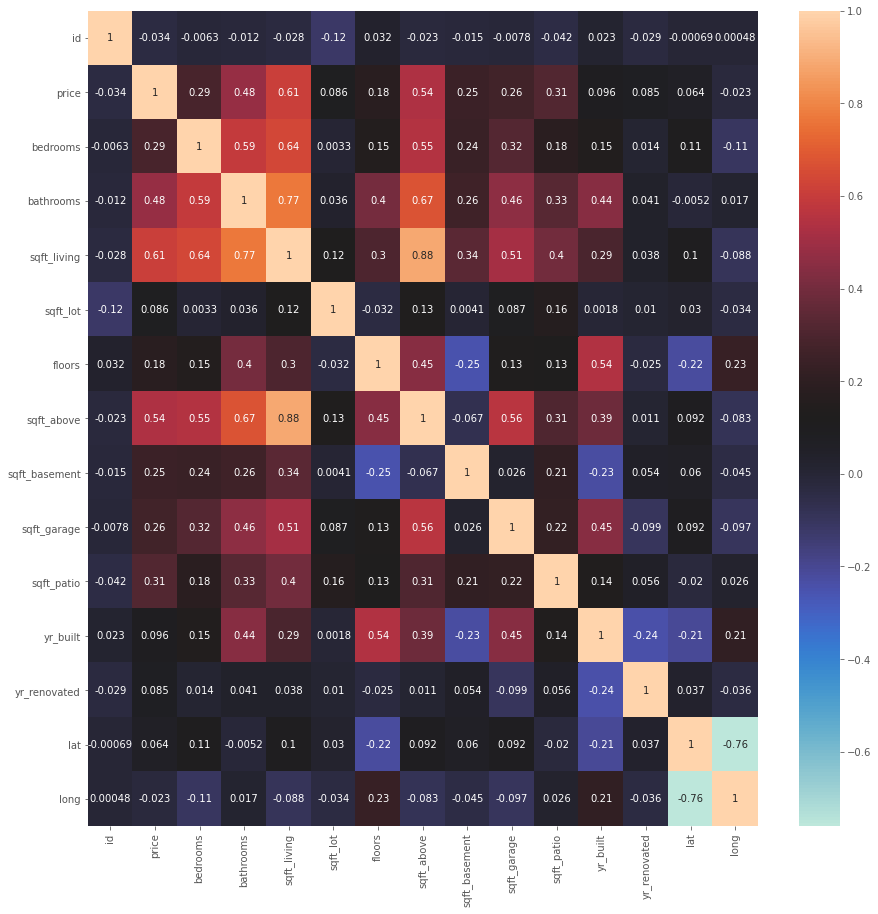

# King County Real Estate 
Project for phase 2 of Flatiron's data science program

**Author:** [Emmi Galfo](mailto:emmi.galfo@gmail.com)

## Overview 

This project looks at factors that influence price in the King County real estate market. Through linear regression modeling, predictors such as square footage, number of bedrooms, number of bathrooms, condition, grade, and views were factored in to determine their effects on housing price. The project ultimately finds that more bedrooms are associated with lower prices, and conversley, more bathrooms and square footage are each assiciated with higher home prices all else constant.  The better views are linked with higher home prices as well as better grade and home conditions all else constant. 

## Business Problem

A real estate agent is helping a couple find a house in King County. In order to stay within a set budget, the couple is interested in seeing how different factors affect overall price. This project looks at the following variables and their affect on the price of buying a house in King County, Washington:
*  Square Footage
*  Number of Bedrooms
*  Number of Bathrooms
*  House Condition 
*  Quality of the View

## Data Understanding

For this project, data was gathered and used from the King County assessor's website. Below are descriptions taken from the database describing each column used in this project.  

### Column Names and Descriptions for King County Data Set

* `id` - Unique identifier for a house
* `price` - Sale price (prediction target)
* `bedrooms` - Number of bedrooms
* `bathrooms` - Number of bathrooms
* `sqft_living` - Square footage of living space in the home
* `view` - Quality of view from house
  * Includes views of Mt. Rainier, Olympics, Cascades, Territorial, Seattle Skyline, Puget Sound, Lake Washington, Lake Sammamish, small lake / river / creek, and other
* `condition` - How good the overall condition of the house is. Related to maintenance of house.
  * See the [King County Assessor Website](https://info.kingcounty.gov/assessor/esales/Glossary.aspx?type=r) for further explanation of each condition code
* `grade` - Overall grade of the house. Related to the construction and design of the house.
  * See the [King County Assessor Website](https://info.kingcounty.gov/assessor/esales/Glossary.aspx?type=r) for further explanation of each building grade code

Most fields were pulled from the [King County Assessor Data Download](https://info.kingcounty.gov/assessor/DataDownload/default.aspx).

## Data Preparation

### Target: 
The target variable for this project is __price__. The clients want to know how much certain factors will contribute to the overall price of a house. 
Let's look at the correlation each factor has with price. 

